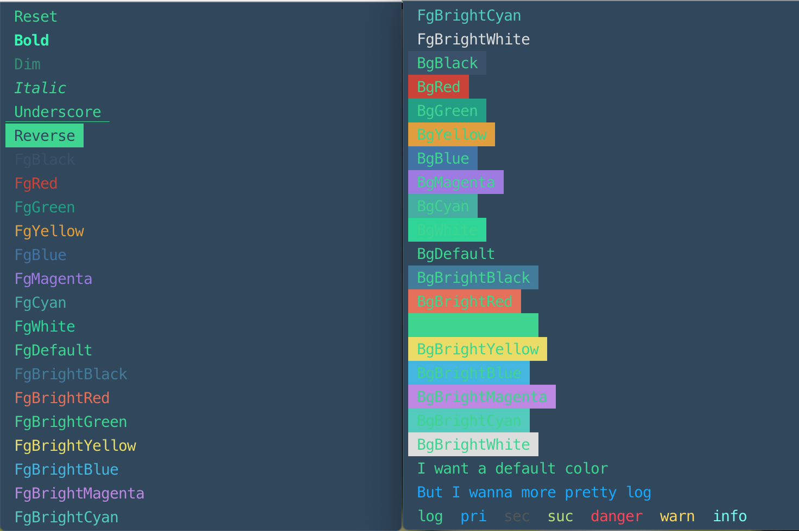
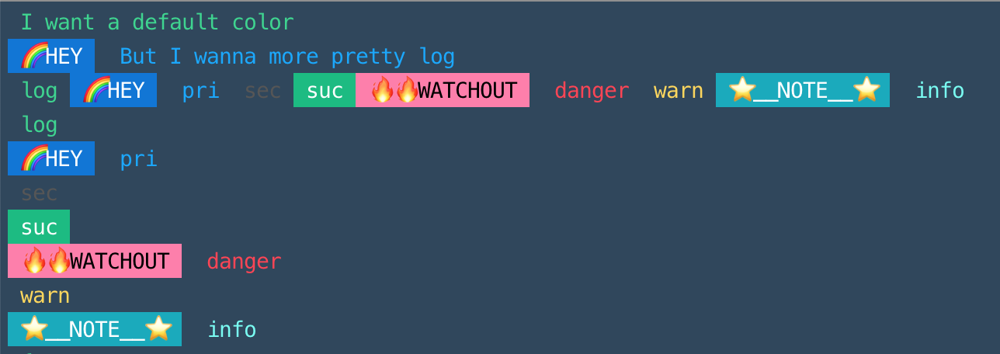
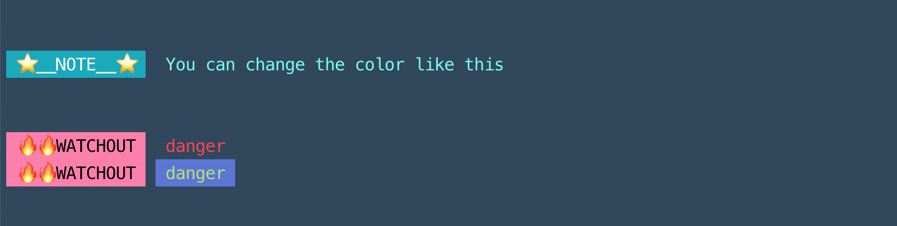

# colorlog-css

🌈 Colorize your ugly console.log with your css !




## Installation

```sh
npm install colorlog-css --save
yarn add colorlog-css
```

## Usage

### Javascript

```js
var colorLog = require('colorlog-css')
var clg = new colorLog.ColorLog('./MyColors.css')

clg.list()
clg.log('I want a default color')
clg.pri('But I wanna more pretty log')
```

### TypeScript

```ts
import { ColorLog } from 'colorlog-css'

const clg = new ColorLog('./MyColors.css') // or new ColorLog()
clg.list()
clg.suc('cess :)')
clg
  .join()
  .log('log')
  .pri('pri')
  .sec('sec')
  .suc('suc')
  .danger('danger')
  .warn('warn')
  .info('info')
  .end()
```

## How to change color ?

Make a CSS file for customizing your own color :)

- Selectors
  - Class Format
    - `.primary`
    - `.secondary`
    - `.success`
    - `.danger`
    - `.warning`
    - `.info`
    - `.default`
  - Id Format
    - `#pre`
      - `val` property represent the value of prefix

```css
/* Sample */

.success {
  background: #00bc80;
  color: rgb(255, 255, 255);
}

.danger #pre {
  background: #ff7dab;
  color: rgb(0, 0, 0);
  val: 🔥 🔥 WATCH OUT;
}

.primary #pre {
  background: rgb(0, 115, 216);
  color: rgb(255, 255, 255);
  val: 🌈 HEY;
}

.info #pre {
  background: rgba(0, 170, 189, 0.612);
  color: rgb(255, 255, 255);
  val: ⭐️ __NOTE__ ⭐️;
}
```

```ts
import { ColorLog } from 'colorlog-css'

const clg = new ColorLog('./sample.css')
clg.list()
```

or programmatically,

```ts
import { ColorLog, Colors } from 'colorlog-css'

const clg = new ColorLog()

clg.info('You can change the color like this', '\n\n')

clg.danger('danger')
clg.categories.danger.color = clg.makeForm(null, clg.gen('rgb(90, 115, 216)'))
clg.categories.danger.color = clg.makeForm(
  Colors.BrightGreen,
  clg.gen('rgb(90, 115, 216)')
)
clg.danger('danger')
```

Output will look like this ✨



## TODO...

- [ ] Make it available to customize default color set.
- [ ] Any ideas ? 😄

Any questions or suggestions are always welcome 🍀
